# macOS Endpoint Automation — from power-on to a usable machine

A design for zero-touch macOS provisioning, written the way it would actually be built:
every hop stated, every hop verified, and every hop honest about whether the author has
run it or only specified it.

This is a **method repository**. It publishes the chain, the decision criteria, the lab
specification and the acceptance rules in full. It does not publish a fleet, an employer,
or a case study.

---

## Honesty markers

Inherited from [`sysadmin-self-cultivation`](https://github.com/vicenteliu/sysadmin-self-cultivation)'s
ADR-0003, plus one this repository adds.

| | Means |
|---|---|
| 🔨 | **Operated for real**, with consequences. Survives a deep follow-up question. |
| 🧭 | **Verified ramp** — mapped and doc-checked, sometimes lab-verified. Not run in production. |
| ⛔ | **Specced-Not-Run** — a complete environment spec, verification steps and acceptance criteria, **deliberately not executed**, with the reason stated. Not the same as 🧭: 🧭 has no plan, this has a plan and a stated reason for stopping. |

The test, unchanged: *if an interviewer said "walk me through a time you did this, in
detail," would it hold?* A 🔨 with nothing behind it is the overclaim these markers exist
to make impossible.

## The chain

```mermaid
flowchart LR
    A["Power on<br/>Setup Assistant"] --> B["ADE profile fetch"]
    B --> C["MDM enrolment"]
    C --> D["Configuration profiles"]
    D --> E["Certificate delivery"]
    E --> F["802.1X association"]
    F --> G["Software distribution"]
    G --> H["Identity / SSO"]
    H --> I["Usable device"]

    style B fill:#2d5016,color:#fff
    style C fill:#2d5016,color:#fff
    style E fill:#6b1010,color:#fff
    style F fill:#6b1010,color:#fff
    style G fill:#4a4a10,color:#fff
    style H fill:#333,color:#fff
```

green 🔨 · olive 🔨 bounded lab · red ⛔ Specced-Not-Run · grey optional extension

## Layout

| Path | What |
|---|---|
| [`docs/00-the-chain.md`](docs/00-the-chain.md) | The spine — every hop, what it does, what it costs when it breaks |
| [`docs/01-mdm-selection.md`](docs/01-mdm-selection.md) | Choosing between Jamf Pro, Workspace ONE, Intune and Kandji — and the disclosure below |
| [`docs/02-lab-tiers.md`](docs/02-lab-tiers.md) | Three environment tiers, and the exact hop each one **cannot** verify |
| [`phases/`](phases/) | Phase by phase: prerequisites, steps, verification, acceptance |
| [`EXPLAIN.md`](EXPLAIN.md) | The same chain, told to someone who will never touch it |
| [`DISCLOSURE.md`](DISCLOSURE.md) | What this repository deliberately does not contain, and why |

## Disclosure

The author also maintains [`muster`](https://github.com/vicenteliu/muster), an open-source
fleet-management agent. **It is deliberately not a candidate in this repository's MDM
comparison**, and the reason is worth stating rather than leaving for a reader to notice: a
vendor-neutral comparison written by someone shipping a product in the same category stops
reading as a framework and starts reading as a pitch. Keeping it out protects the
comparison's neutrality and lets `muster` stay what it is — a build-to-learn project rather
than a candidate in its author's own selection framework.

`muster` does not implement the Apple MDM protocol and is not an alternative to anything
compared here.

## Status

🚧 **Architecture first, content progressively.** The structure, the markers and the
acceptance rules are settled. Sections are filled in as each is actually worked through —
a heading with no body means not yet done, not forgotten.

**Written so far:** [phase 3 — software distribution](phases/3-software/) 🔨, the only phase with a
run behind it, and [phase 4 — network access](phases/4-network-access/) ⛔, the worked example of
Specced-Not-Run. What comes next and why is in [TODO.md](TODO.md).
