# macOS Endpoint Automation

**From a sealed box to a machine someone can work on — every hop stated, every hop verified, and
every hop honest about whether it was run or only specified.**

This is a **method repository**. It publishes the chain, the selection criteria, the lab
specification and the acceptance rules in full. It publishes no fleet, no employer and no case
study — see [DISCLOSURE.md](DISCLOSURE.md) for where that line sits and why.

---

## Start here

| If you are… | Read |
|---|---|
| deciding whether this is worth your time | the two paragraphs directly below |
| building this | [the chain](docs/00-the-chain.md) → the written phases → [lab tiers](docs/02-lab-tiers.md) |
| choosing a management product | [selection criteria](docs/01-mdm-selection.md) |
| explaining it to someone who will never touch it | [EXPLAIN.md](EXPLAIN.md) |
| checking what is and is not claimed here | [the markers](#honesty-markers), then [DISCLOSURE.md](DISCLOSURE.md) |

### Why the markers exist, in one example

A careful pass over the documentation of two packaging tools produced **three wrong version
facts**: a release that had never shipped treated as stable, a feature attributed to the version
that introduced it when the previous one already had it, and two sources read as contradicting
each other when one date had been misread. **Anyone following those notes would have put a
release candidate into production.**

Running the same thing for one afternoon corrected all three, and surfaced a mechanism the
documentation does not state at all ([phase 3](phases/3-software/)). **Doc-checked and run are
different states.** Every claim here says which one it is — including the ones that say *not run,
and here is why*.

---

## The chain

```mermaid
flowchart LR
    A["Power on<br/>Setup Assistant"] --> B["Ownership record<br/>→ enrolment profile"]
    B --> C["Enrolment<br/>supervision + trust"]
    C --> D["Configuration<br/>profiles"]
    D --> E["Certificate<br/>delivery"]
    E --> F["802.1X<br/>association"]
    F --> G["Software<br/>distribution"]
    G --> H["Identity / SSO<br/>(optional)"]
    H --> I["Usable<br/>device"]

    style B fill:#2d5016,color:#fff
    style C fill:#2d5016,color:#fff
    style D fill:#4a4a10,color:#fff
    style E fill:#6b1010,color:#fff
    style F fill:#6b1010,color:#fff
    style G fill:#4a4a10,color:#fff
    style H fill:#333,color:#fff
```

🟩 hands-on · 🟨 hands-on, bounded to a lab · 🟥 specced, not run · ⬛ optional extension

🔑 **The interesting failures are at the joints, not inside the links.** Every hop above is
documented by its vendor; what is not documented is what the next hop assumes about the previous
one. And they fail the same way — **silently, looking like success**: a device missing from the
ownership record becomes an ordinary working machine that is simply not yours; an update waits
politely and forever for an application to close; a policy mechanism stops functioning at an OS
version and the compliance posture changes without anyone changing anything.

---

## What is written

Honest state, because it is the point rather than an apology.

| Phase | | State |
|---|---|---|
| 1 — enrolment | 🔨 | skeleton |
| **2 — [configuration](phases/2-configuration/)** | 🔨 bounded | ✅ written — its hop 2 states ⏰ **what is actually changing in 2026**, which is not what most pages say it is |
| **3 — [software distribution](phases/3-software/)** | 🔨 lab | ✅ written — **the only phase with a run behind it** |
| **4 — [network access](phases/4-network-access/)** | ⛔ | ✅ written — the worked example of *Specced-Not-Run*, with the reason stated **per tier** |
| 5 — identity *(optional)* | 🧭 | skeleton |
| 6 — operations | 🔨 | partial — its third hop *is* [EXPLAIN.md](EXPLAIN.md); the rest is skeleton |

A heading with no body means **not yet done**, not forgotten. What comes next and the reasoning
for that order is in [TODO.md](TODO.md).

**There is no phase 0.** It was in the original outline as *ground* — tier selection, product
selection, administrator workstation — and every one of those found a better home: the first two
are [docs/02](docs/02-lab-tiers.md) and [docs/01](docs/01-mdm-selection.md), and the third is
per-phase **Prerequisites**, because what the admin machine needs differs by phase. An empty
directory implying content is coming, when nothing is missing, is the same false signal as an
under-claimed marker.

⛔ **Phase 5 has no worked material behind it** and is a genuine ramp. Writing it from
documentation alone would make this a summary of other people's pages, which is the one thing the
markers exist to prevent.

---

## Honesty markers

Inherited from [`sysadmin-self-cultivation`](https://github.com/vicenteliu/sysadmin-self-cultivation)'s
ADR-0003, plus one this repository adds.

| | Means |
|---|---|
| 🔨 | **Operated for real**, with consequences. Survives a deep follow-up question. |
| 🧭 | **Verified ramp** — mapped and doc-checked, sometimes lab-verified. Not run in production. |
| ⛔ | **Specced-Not-Run** — a complete environment spec, verification steps and acceptance criteria, **deliberately not executed, with the reason stated**. Not a missing 🧭: a 🧭 has no plan, this has a plan and a stated reason for stopping. [Why it earns its own symbol](docs/adr/0001-specced-not-run-is-a-third-marker.md) |

The test, unchanged: *if an interviewer said "walk me through a time you did this, in detail,"
would it hold?* A 🔨 with nothing behind it is the overclaim these markers exist to make
impossible — and an under-claim is the same defect pointing the other way.

---

## Layout

| Path | What |
|---|---|
| [`docs/00-the-chain.md`](docs/00-the-chain.md) | The spine — every hop, and what the next one assumes about it |
| [`docs/01-mdm-selection.md`](docs/01-mdm-selection.md) | Jamf Pro, Workspace ONE, Intune, Kandji — the three questions that actually decide it, and the disclosure below |
| [`docs/02-lab-tiers.md`](docs/02-lab-tiers.md) | Three environment tiers, defined by **the hop each one cannot verify** |
| [`docs/adr/`](docs/adr/) | Decisions that would otherwise look arbitrary |
| [`phases/`](phases/) | Prerequisites · steps · verification · acceptance · escape hatch, per phase |
| [`EXPLAIN.md`](EXPLAIN.md) | The same chain with zero jargon — and a stated test for whether it worked |
| [`DISCLOSURE.md`](DISCLOSURE.md) | What this repository deliberately does not contain |
| [`TODO.md`](TODO.md) | What gets written next, and why in that order |

---

## Disclosure

The author also maintains [`muster`](https://github.com/vicenteliu/muster), an open-source fleet
agent. **It is deliberately not a candidate in this repository's management-product comparison.**

Saying so is cheaper than leaving it to be discovered. A vendor-neutral comparison written by
someone shipping a product in the same category stops reading as a framework and starts reading as
a pitch, and a reader cannot un-notice that. Keeping it out protects the comparison's neutrality
and lets `muster` stay what it is — a build-to-learn project, not a candidate in its author's own
selection framework. It also does not implement the Apple MDM protocol, so it is not an
alternative to anything compared here.

---

MIT. Written in the open; corrections against the vendor documentation are welcome and the
version-dated claims are the ones most likely to need them.
