# macOS Endpoint Automation

**An endpoint-engineering playbook: the chain from a sealed box to a machine someone can work on,
one runbook per phase, and the decisions in between — with every hop honest about whether it was
run or only specified.**

`SE-` is the project prefix of [The Scrappy Engineer](https://linkedin.com/in/vicenteliu), the
author's channel; this is the first `SE-` project. It is written for two readers, in this order:
**someone with five minutes who needs to know what the author has and has not actually done**, and
**the author on the job**, where it is the frame a fleet is run from and tuned per environment. It
publishes no fleet, no employer and no case study — [DISCLOSURE.md](DISCLOSURE.md) says where that
line sits and why.

---

## Where the author stands

Markers, not adjectives. The legend is [below](#honesty-markers); the test behind every line is
*"walk me through a time you did this, in detail — would it hold?"*

| | |
|---|---|
| 🔨 | **Ownership record and zero-touch enrolment**, administered on a large enterprise Apple estate |
| 🔨 | **Jamf Pro** — console and API, for inventory reads and policy dispatch; bounded to one region's testing and maintenance |
| 🔨 | **Workspace ONE** — lifecycle end to end, including a BYOD programme and targeted application distribution |
| 🔨 | **Key escrow** — a self-built store, keyed by serial, used to bring machines back |
| 🔨 | **Munki + AutoPkg** — the pipeline stood up end to end *once*: one machine, one afternoon, two applications, no fleet |
| ⛔ | **802.1X / EAP-TLS** — specified to three lab tiers, deliberately not run, reason stated per tier |
| 🧭 | **Intune** and **Kandji** as selection-and-architecture only; **privacy pre-authorisation (TCC/PPPC)** mapped, not operated |

Everything above is stated at the depth the phases state it, and no deeper. The number behind
*"large"* and the organisation behind *"a region"* are exactly the details
[DISCLOSURE.md](DISCLOSURE.md) keeps out.

---

## The chain

```mermaid
flowchart LR
    A["Power on<br/>Setup Assistant"] --> B["Ownership record<br/>→ enrolment profile"]
    B --> C["Enrolment<br/>supervision + trust"]
    C --> D["Configuration<br/>profiles"]
    D --> E["Certificate<br/>delivery"]
    E --> F["802.1X<br/>association"]
    F --> G["Software<br/>distribution"]
    G --> H["Identity / SSO<br/>(optional)"]
    H --> I["Usable<br/>device"]

    style B fill:#2d5016,color:#fff
    style C fill:#2d5016,color:#fff
    style D fill:#4a4a10,color:#fff
    style E fill:#6b1010,color:#fff
    style F fill:#6b1010,color:#fff
    style G fill:#4a4a10,color:#fff
    style H fill:#333,color:#fff
```

🟩 hands-on · 🟨 hands-on, bounded to a lab · 🟥 specced, not run · ⬛ optional extension

🔑 **The interesting failures are at the joints, not inside the links.** Every hop above is
documented by its vendor; what is not documented is what the next hop assumes about the previous
one. And they fail the same way — **silently, looking like success**: a device missing from the
ownership record becomes an ordinary working machine that is simply not yours; an update waits
politely and forever for an application to close; a policy mechanism stops functioning at an OS
version and the compliance posture changes without anyone changing anything.

The spine, hop by hop and with what each one assumes of the last, is
[docs/00-the-chain.md](docs/00-the-chain.md).

---

## The runbooks

One per phase. Each has the same six sections — **prerequisites · the hops · how the phase
fails · verification, one row per hop · one acceptance · an escape hatch** — because a phase is
the boundary of acceptance and a hop is the unit that gets verified.

| Phase | | State |
|---|---|---|
| **1 — [enrolment](phases/1-enrolment/)** | 🔨 | ✅ written — every failure in it is silent and looks like success |
| **2 — [configuration](phases/2-configuration/)** | 🔨 bounded | ✅ written — its hop 2 states ⏰ **what is actually changing in 2026**, which is not what most pages say it is |
| **3 — [software distribution](phases/3-software/)** | 🔨 lab | ✅ written — **the only phase with a run behind it**, and so the only one whose verification table already carries commands |
| **4 — [network access](phases/4-network-access/)** | ⛔ | ✅ written — the worked example of *Specced-Not-Run*, with the reason stated **per tier** |
| **5 — [identity](phases/5-identity-optional/)** *(optional)* | 🔨 / 🧭 | ✅ written — the trust-boundary hop closes phase 4's loop from the other side |
| **6 — [operations](phases/6-operations/)** | 🔨 | ✅ written — severity as a lived scheme, and tiering when the users out-technicalise the support team |

**There is no phase 0.** It was in the original outline as *ground* — tier selection, product
selection, administrator workstation — and every one of those found a better home: the first two
are [docs/02](docs/02-lab-tiers.md) and [docs/01](docs/01-mdm-selection.md), and the third is
per-phase **Prerequisites**, because what the admin machine needs differs by phase.

**Inheriting a fleet you did not build?** The page for that — the verification rows above,
re-ordered into the sequence you run them in on arrival, each with what you decide from the
answer — is the next thing written. [TODO.md](TODO.md) has the order and the reason.

---

## Honesty markers

Inherited from [`sysadmin-self-cultivation`](https://github.com/vicenteliu/sysadmin-self-cultivation)'s
ADR-0003, plus one this repository adds.

| | Means |
|---|---|
| 🔨 | **Operated for real**, with consequences. Survives a deep follow-up question. |
| 🧭 | **Verified ramp** — mapped and doc-checked, sometimes lab-verified. Not run in production. |
| ⛔ | **Specced-Not-Run** — a complete environment spec, verification steps and acceptance criteria, **deliberately not executed, with the reason stated**. Not a missing 🧭: a 🧭 has no plan, this has a plan and a stated reason for stopping. [Why it earns its own symbol](docs/adr/0001-specced-not-run-is-a-third-marker.md) |

The test, unchanged: *if an interviewer said "walk me through a time you did this, in detail,"
would it hold?* A 🔨 with nothing behind it is the overclaim these markers exist to make
impossible — and an under-claim is the same defect pointing the other way.

### Why the markers exist, in one example

A careful pass over the documentation of two packaging tools produced **three wrong version
facts**: a release that had never shipped treated as stable, a feature attributed to the version
that introduced it when the previous one already had it, and two sources read as contradicting
each other when one date had been misread. **Anyone following those notes would have put a
release candidate into production.**

Running the same thing for one afternoon corrected all three, and surfaced a mechanism the
documentation does not state at all ([phase 3](phases/3-software/)). **Doc-checked and run are
different states.** Every claim here says which one it is — including the ones that say *not run,
and here is why*.

The same rule bounds the code: a command appears wherever a lab tier can produce it, and a
script appears only where one was actually run.

---

## Layout

| Path | What |
|---|---|
| [`docs/00-the-chain.md`](docs/00-the-chain.md) | The spine — every hop, and what the next one assumes about it |
| [`docs/01-mdm-selection.md`](docs/01-mdm-selection.md) | Jamf Pro, Workspace ONE, Intune, Kandji — the three questions that actually decide it, and the disclosure below |
| [`docs/02-lab-tiers.md`](docs/02-lab-tiers.md) | Three environment tiers, defined by **the hop each one cannot verify** |
| [`docs/adr/`](docs/adr/) | Decisions that would otherwise look arbitrary |
| [`phases/`](phases/) | One runbook per phase — prerequisites · hops · how it fails · verification · acceptance · escape hatch |
| [`EXPLAIN.md`](EXPLAIN.md) | The same chain with zero jargon — and a stated test for whether it worked |
| [`DISCLOSURE.md`](DISCLOSURE.md) | What this repository deliberately does not contain |
| [`CONTEXT.md`](CONTEXT.md) | The words this repository uses, and what each is chosen against |
| [`TODO.md`](TODO.md) | What gets written next, and why in that order |

---

## Disclosure

The author also maintains [`muster`](https://github.com/vicenteliu/muster), an open-source fleet
agent. **It is deliberately not a candidate in this repository's management-product comparison.**

Saying so is cheaper than leaving it to be discovered. A vendor-neutral comparison written by
someone shipping a product in the same category stops reading as a framework and starts reading as
a pitch, and a reader cannot un-notice that. Keeping it out protects the comparison's neutrality
and lets `muster` stay what it is — a build-to-learn project, not a candidate in its author's own
selection framework. It also does not implement the Apple MDM protocol, so it is not an
alternative to anything compared here.

---

MIT. Written in the open; corrections against the vendor documentation are welcome and the
version-dated claims are the ones most likely to need them.
